# Лабораторная работа №6
## Сегментация текста

### Вариант 6: Персидский алфавит

### Исходные данные

- Фраза: `د و س ت ت   د ا ر م`
- Перевод фразы: `Я люблю тебя`
- Ожидаемое количество символов без пробелов: `9`
- Направление чтения: `rtl`
- Шрифт: `NotoNaskhArabic-Regular.ttf`, размер `92`
- Размер монохромного изображения: `710x110`
- Количество найденных сегментов: `9`

### Формулы профилей

```text
H(y) = sum_x I_b(x, y)
V(x) = sum_y I_b(x, y)
```

Где `I_b(x, y) = 1` для черного пикселя и `0` для белого.

### 1. Подготовка строки

#### 1.1 Монохромное изображение фразы

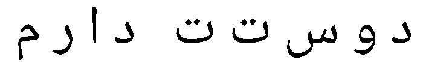

### 2. Профили изображения

| Горизонтальный профиль | Вертикальный профиль |
|:----------------------:|:--------------------:|
| 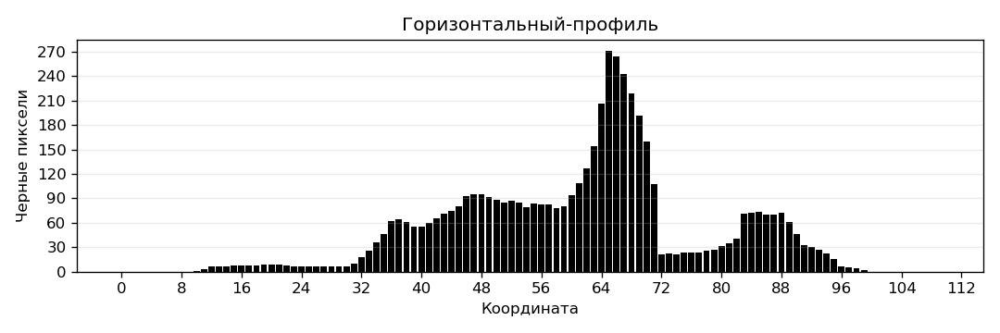 | 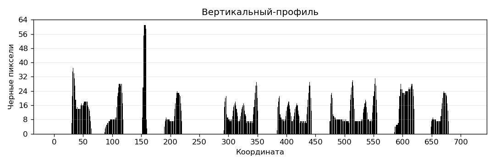 |

### 3. Сегментация символов

Сегментация выполнена на основе вертикального профиля. Пустые вертикальные промежутки используются как границы между символами. Так как персидское письмо является связным, для учебной демонстрации символы во фразе разделены пробелами.

#### 3.1 Обрамляющие прямоугольники

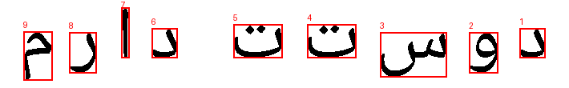

#### 3.2 Вырезанные сегменты

- Сегмент 1: 
- Сегмент 2: 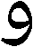
- Сегмент 3: 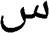
- Сегмент 4: 
- Сегмент 5: 
- Сегмент 6: 
- Сегмент 7: 
- Сегмент 8: 
- Сегмент 9: 

#### 3.3 Массив координат прямоугольников

| idx | x0 | y0 | x1 | y1 | w | h |
|---:|---:|---:|---:|---:|---:|---:|
| 1 | 648 | 35 | 680 | 72 | 33 | 38 |
| 2 | 585 | 40 | 621 | 91 | 37 | 52 |
| 3 | 474 | 40 | 557 | 96 | 84 | 57 |
| 4 | 383 | 30 | 444 | 72 | 62 | 43 |
| 5 | 291 | 30 | 352 | 72 | 62 | 43 |
| 6 | 189 | 35 | 221 | 72 | 33 | 38 |
| 7 | 151 | 9 | 161 | 72 | 11 | 64 |
| 8 | 86 | 40 | 120 | 91 | 35 | 52 |
| 9 | 29 | 39 | 65 | 100 | 37 | 62 |

CSV с координатами (`;`-разделитель): `results/segments_boxes.csv`

### 4. Профили символов выбранного алфавита

- Эталоны символов: `src/alphabet/templates/`
- Профили X/Y: `src/alphabet/profiles/`
- Построены для всех `32` символов персидского алфавита варианта 6.

Пример — первые 8 символов:

| Символ | Эталон | Профиль X | Профиль Y |
|:------:|:------:|:---------:|:---------:|
| ا |  | 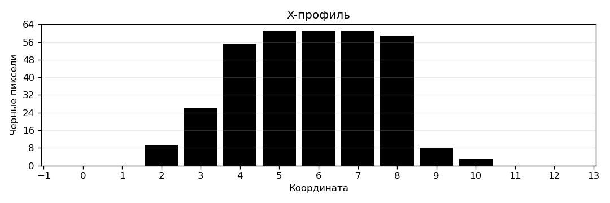 | 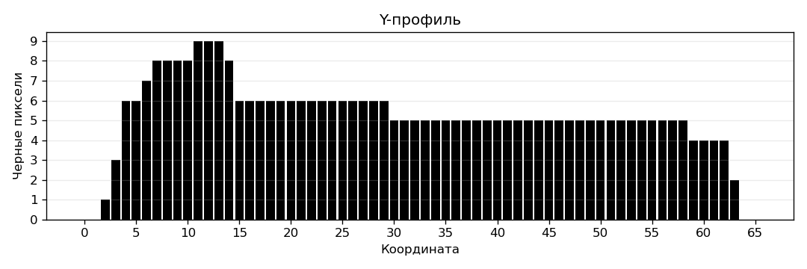 |
| ب | 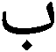 | 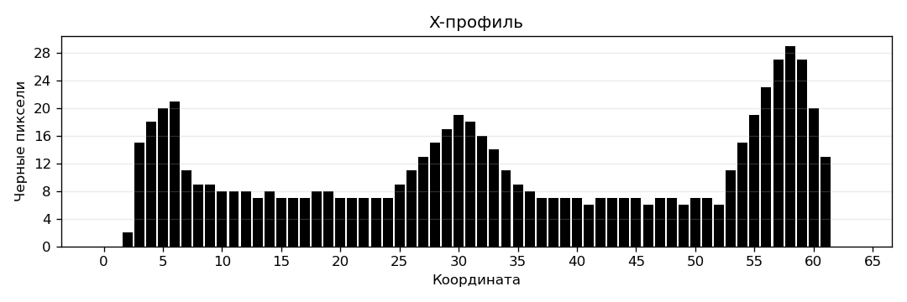 | 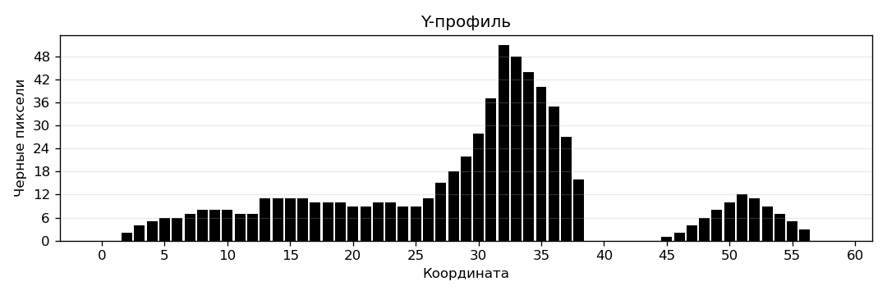 |
| پ | 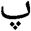 | 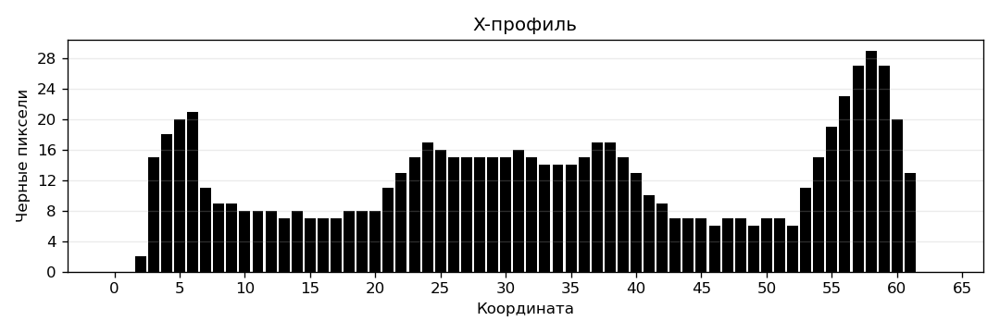 | 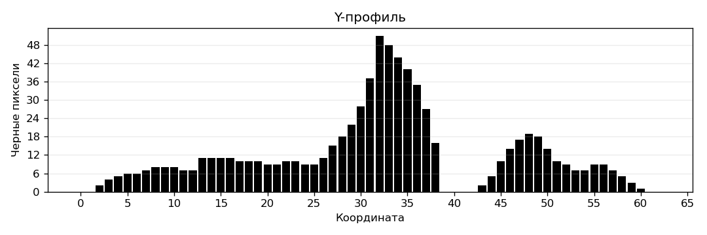 |
| ت |  | 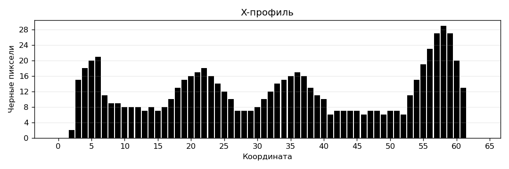 | 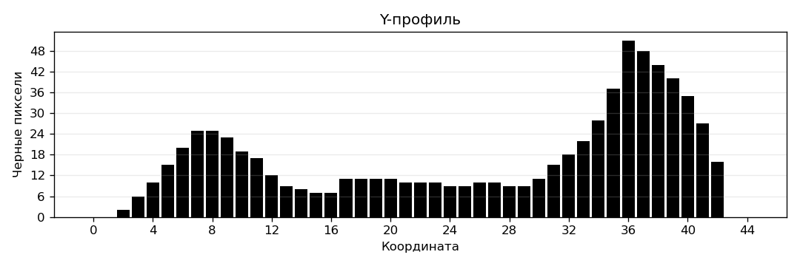 |
| ث |  | 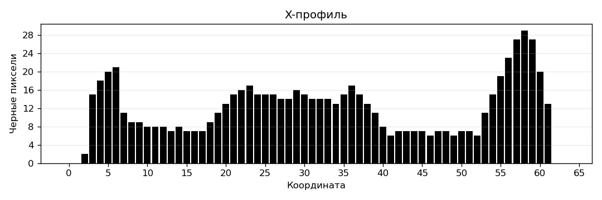 | 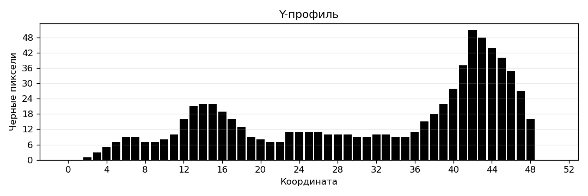 |
| ج | 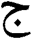 | 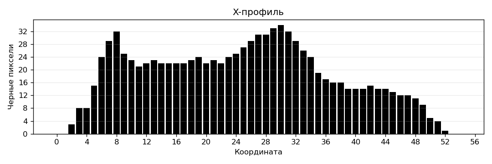 | 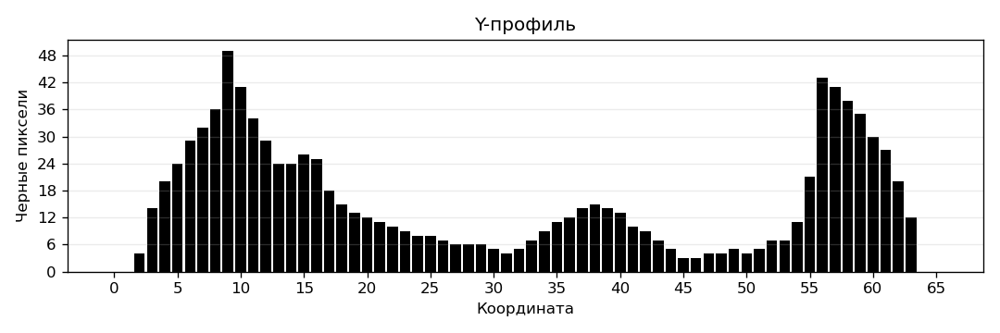 |
| چ |  | 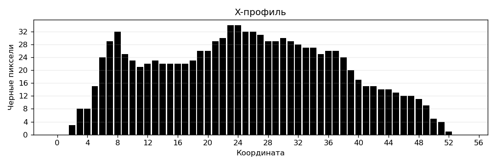 | 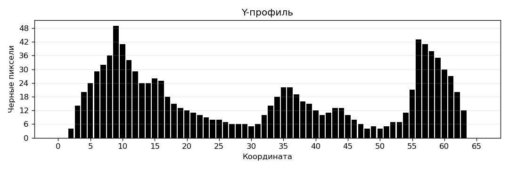 |
| ح | 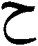 | 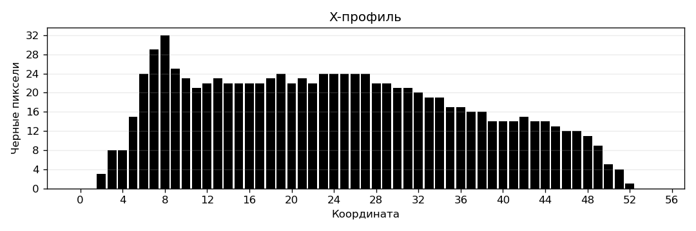 | 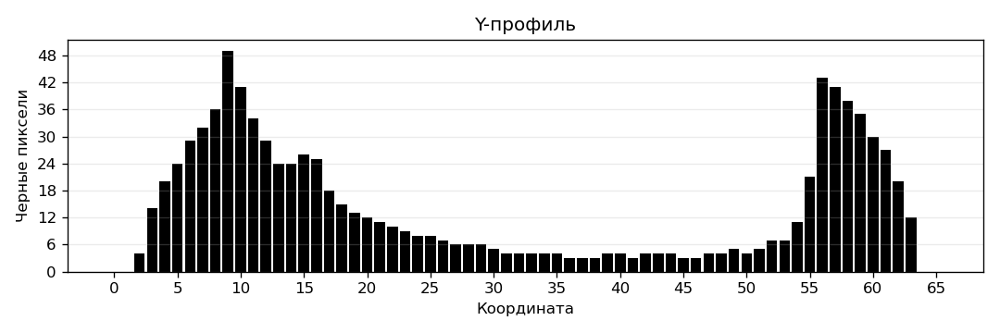 |


